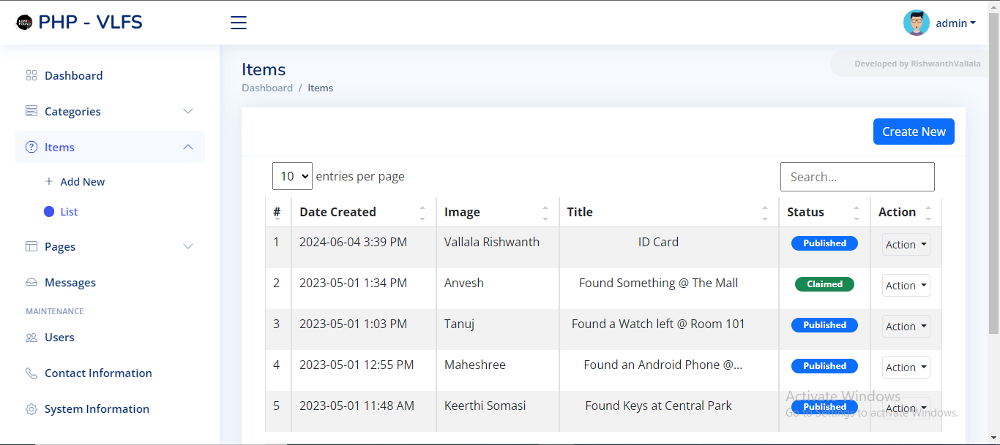
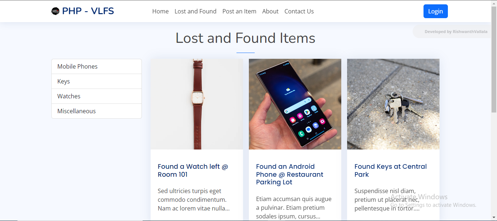

# Lost and Found Information System

The Lost and Found Information System comprises two modules: Public and Management sites.

## Management Site

Accessible only to system administrators and staff, it requires valid credentials for access. Administrators manage system data, including user lists, categories, items, and system information. Staff members have limited permissions. Additionally, the management site enables dynamic updates to select public site content.

## Public Site

Visitors can explore published unclaimed items, view various page content, and send inquiries or concerns. The posted item list can be filtered by category for easy navigation.
This web application simplifies lost and found item management, enhancing user experience and efficiency.

## Features and Functionalities

### Management

- **Login and Logout**
- **Dashboard**
- **List Summary**
- **Image Slider**
- **Category Management**
  - Add New Category
  - List All Categories
  - View Category Details
  - Update Category Details
  - Delete Category
- **Item Management**
  - Add New Item
  - List All Items
  - View Item Details
  - Update Item Details
  - Delete Item
- **User Management**
  - Add New User
  - List All Users
  - Update User Details
  - Delete User
- **Messages Management**
  - List All Messages/Inquiries
  - Read Message Details
  - Delete Message
- **Page Management**
  - Home Page Content
  - "About Us" Content
  - Update Contact Information
  - Update Account Details
  - Update System Information

### Public Site

- **Home Page**
- **List All Published Lost and Found Items**
- **Filter Lost and Found Item List by Category**
- **Post an Item that has been found (subject to approval)**
- **"About Us" Page**
- **Contact Information Page**
- **Send Message**

### How To Run ?

**Requirements:**
1. Download and install a local web server like XAMPP.

**System Installation/Setup:**
1. Launch XAMPP and start both Apache and MySQL services.
2. Download the source code zip file.
3. Extract the contents of the downloaded zip file.
4. Copy the extracted source code folder and paste it into the "htdocs" directory of XAMPP.
5. Open a web browser and access PHPMyAdmin by entering this address: http://localhost/phpmyadmin.
6. In PHPMyAdmin, create a new database and name it "vlfs_db."
7. Import the provided SQL file, which can be found as "vlfs_db.sql" in the database folder.
8. Finally, open the Lost and Found Information System in your web browser by visiting this address: http://localhost/php-vlfs/.

Following these steps will set up the system for you to run and use.

